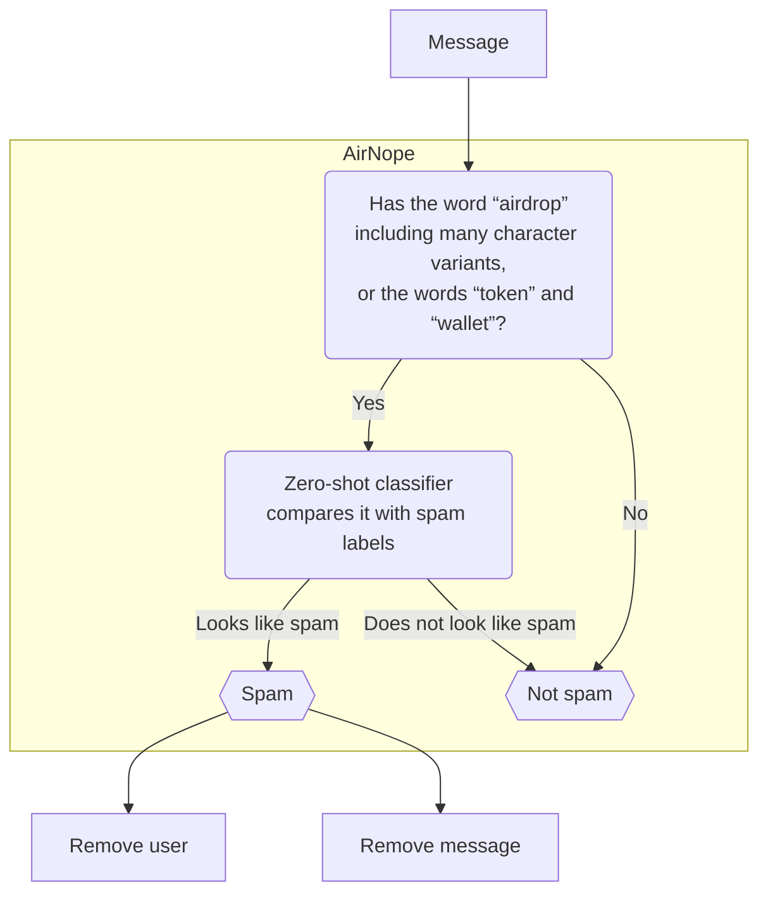

# AirNope

A simple, silent bot that keeps [Telegram](https://telegram.org/) groups free from crypto airdrop spams.

## What is AirNope?

### What it does

When the user posting the message is **not** one of the group admins or the group owner:

 * deletes the message that is probably airdrop spam
 * removes from the group the user who posted it



#### What it does not do

* does **not** post any message in the group (avoids pollution of the group)
* does **not** keep any history of messages or users

## How to use AirNope?

1. Add [`@airnope_bot`](https://telegram.me/airnope_bot) to your group
2. Make [`@airnope_bot`](https://telegram.me/airnope_bot) an admin able to delete messages and remove users

## FAQ

### Is there a privacy policy?</summary>

AirNope is designed to detect spam messages, and in some cases, it might log them for debugging purposes. While logging these messages, there is a possibility that personally identifiable information (PII) might be inadvertently captured. We understand the importance of privacy and are committed to ensuring that any PII collected is not processed or persisted. Logs are temporary and are deleted periodically, either during each release cycle or when the bot is restarted.

We are also considering the creation of a database of spam messages to further enhance our spam detection capabilities. However, due to our concern about user privacy and the potential risk of PII exposure, this initiative is not currently part of our roadmap. We will continue to prioritize privacy and will take all necessary measures to protect user information should this initiative be considered in the future.

### Can I test it to see what messages AirNope would consider spam?


Sure!

#### On the web

The easiet way to use the [playground](https://airnope-playground.onrender.com).

#### On your Telegram

The second easiest way is to create a group and [add AirNope](#how-to-use-airnope). Since you would then be the group owner, you will need a second account (friends!) to join the group to see the bot in action.

#### On your terminal

Alternatively, you can use [Docker](https://docs.docker.com/get-started/) and your terminal to test messages locally. Download the Docker image and start the [REPL](https://en.wikipedia.org/wiki/Read%E2%80%93eval%E2%80%93print_loop):

```console
$ docker pull ghcr.io/cuducos/airnope:main
$ docker run -it -e RUST_LOG="info,airnope=debug" ghcr.io/cuducos/airnope:main airnope-repl
```

### Can I run my own instance of AirNope?

Absolutely! And it is really simple:

1. Create a Telegram bot to get your bot's handle and your Telegram API token
2. Download the Docker image with `docker pull ghcr.io/cuducos/airnope:main`
3. Start the bot with `docker run -e TELOXIDE_TOKEN=<TOKEN> ghcr.io/cuducos/airnope:main`
