# AirNope

A simple, silent bot that keeps [Telegram](https://telegram.org/) groups free from crypto airdrop spams.

> [!NOTE]
> AirNope will temporarily remove _Safeguard_ spam because it is becoming as annoying as crypto spam, and it is recognized as a scam.

## What is AirNope?

### What it does

When the user posting the message is **not** one of the group admins or the group owner:

 * deletes the message that is probably airdrop spam
 * removes from the group the user who posted it

```mermaid
flowchart TB

MSG[Message] --> RE(Detect words like “airdrop”)

RE-->|Yes| ZSC(Compare to spam labels)
ZSC-->|Looks like spam| S{{Spam}}
S--> RU[Remove user]
S--> RM[Remove message]

ZSC-->|Does not look like spam| NS
RE-->|No| NS{{Not spam}}

subgraph AirNope
    RE
    ZSC
    NS
    S
end
```



If the user posting the message is the group's owner or an admin, AirNop just reacts with 👀 instead.

#### What it does not do

* does **not** post any message in the group (avoids pollution of the group)
* does **not** keep any history of messages or users

## How to use AirNope?

1. Add [`@airnope_bot`](https://telegram.me/airnope_bot) to your group
2. Make [`@airnope_bot`](https://telegram.me/airnope_bot) an admin able to delete messages and remove users

## FAQ

### Is there a privacy policy?</summary>

AirNope is designed to detect spam messages and, in some cases, log them for debugging purposes. While logging these messages, personally identifiable information (PII) might be inadvertently captured. We understand the importance of privacy and are committed to ensuring that any PII collected is not processed or persisted. Logs are temporary and are deleted periodically during each release cycle or when the bot is restarted.

We are also considering creating a database of spam messages to further enhance our spam detection capabilities. However, due to our concern about user privacy and the potential risk of PII exposure, this initiative is not currently part of our roadmap. We will continue to prioritize privacy and take all necessary measures to protect user information should this initiative be considered.

### Can I test it to see what messages AirNope would consider spam?

Sure!

#### On your Telegram

The easiest way is to send the message to [`@airnope_bot`](https://t.me/airnope_bot). If the message disappears, it means the bot considered it spam and deleted it; otherwise, it's all good.

#### On your terminal

Alternatively, you can use [Docker](https://docs.docker.com/get-started/) and your terminal to test messages locally. Download the Docker image, start the [REPL](https://en.wikipedia.org/wiki/Read%E2%80%93eval%E2%80%93print_loop) and type your message followed by the key press `Enter`/`Return`:

```console
$ docker pull ghcr.io/cuducos/airnope:main
$ docker run --rm -it ghcr.io/cuducos/airnope:main airnope repl
```

Or, if you like Rust and have `cargo` installed, clone this repo and `cargo run -- repl`.

### Can I run my own instance of AirNope?

Absolutely!

1. Create a Telegram bot to get your bot's handle and your Telegram API token
2. Deploy the Docker image `ghcr.io/cuducos/airnope:main` to a publicly accessible URL having two environment variables:
   1. `TELEGRAM_BOT_TOKEN` with your bot's token
   1. `TELEGRAM_WEBHOOK_URL` with your public URL (for example, `https://my.bot`)
